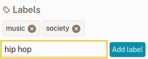

# Bookmark View

Tap any bookmark card to open it. MyDeck displays the bookmark's content based on its type.

Bookmark view — article.

## Content Types

### Article

The article text is extracted and rendered as a clean, distraction-free reading view.

### Picture

The stored image is displayed full-screen.

### Video

A video player loads the content. Note that videos stream from their original servers (YouTube, Vimeo, etc.) and require an internet connection.

## Reading View

For article bookmarks, MyDeck displays the extracted text in a comfortable reading layout. If you'd prefer to see the original web page instead, use the **View Original** option from the top-bar menu. You can switch back to the article view with **View Article**.

## Typography Settings

Tap the **reader settings** button in the top bar to adjust the reading experience.

Reader settings.

You can change the **font**, **font size**, and **line height**. These settings are saved automatically and apply to all articles you read going forward.

## Find in Article

Use the **Find in Article** option from the top-bar menu to search for text within the current bookmark. Matches are highlighted as you type.

## Actions

The top-bar menu provides the following actions:

- **Favorite** — toggle the favorite status
- **Archive** — move the bookmark to the archive (or remove it from there)
- **Mark as Read / Unread** — track your reading progress
- **Share Link** — open the Android share sheet to share the bookmark's URL
- **Open in Browser** — open the original page in your default browser
- **Delete** — mark the bookmark for deletion; an undo option appears briefly

## Editing the Title

The bookmark title is captured automatically when the bookmark is created. To change it, use the **Edit Title** option from the menu.

## Labels

You can add any number of labels to help organise your bookmarks. Open the bookmark details to manage labels — there's no limit on what a label can be, and emojis work too.

Adding a label.

See [Labels](./labels.md) for more.

## Highlights

You can highlight any text in an article. Select text in the reading view and choose **Highlight** from the menu that appears.

Creating a highlight.

Your highlights are saved to the bookmark and synced back to your Readeck server. To remove a highlight, select the highlighted text in the article and choose the delete option, or manage highlights from the bookmark details.
